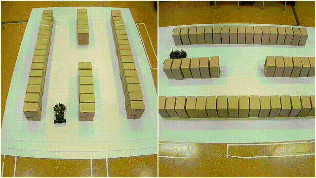
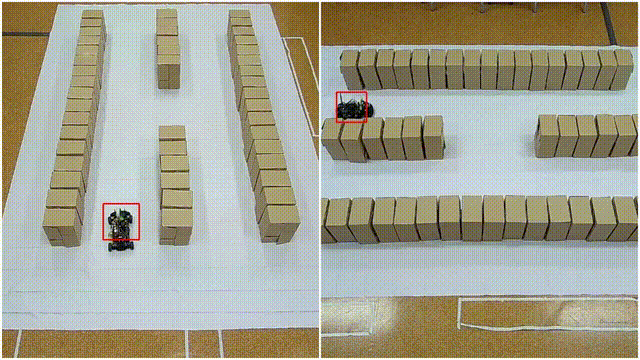
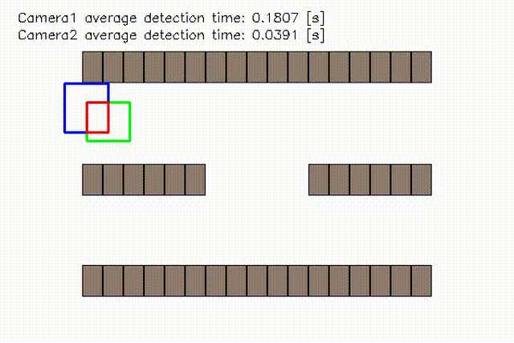
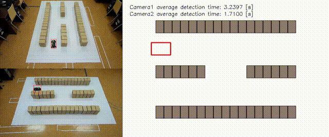
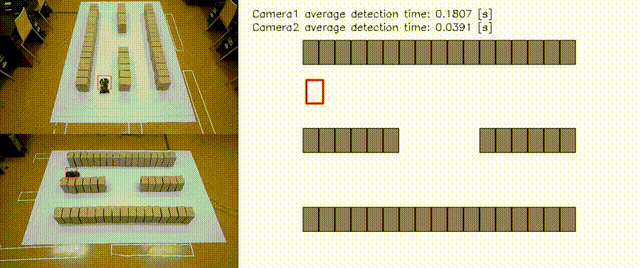

# Robot Localization in a Warehouse Using Computer Vision Algorithms

## Project Description

This project involved developing a robot localization module for warehouse environments using computer vision algorithms and images from two cameras. The goal was to determine the robot's position using object detection methods such as **YOLO v8** and **Haar Cascade Classifier**, and to transform the perspective to localize the robot within the warehouse space.

  

## Project Goal

This project was carried out as part of the **IDS Industrial Data Science** student research group at **AGH University of Science and Technology**. The main objective was to create a system that enables robot localization based on images from two cameras. It was implemented as a component of a **digital twin** of a warehouse.

  

## Technologies Used

- **YOLO v8** – real-time object detection algorithm with high accuracy and speed.
- **Haar Cascade Classifier** – machine learning-based object detection method.
- **Cameras** – two cameras used to collect real-time image data.
- **OpenCV** – library for image and video processing.

## Achieved Goals

1. **Robot Detection** – detecting the robot in camera images using YOLO v8 and Haar Cascade Classifier.
2. **Robot Localization** – determining the robot's position in the warehouse space based on detections.
3. **Perspective Transformation** – image transformation to obtain accurate robot positioning in 3D space.

  

## Detection Algorithms

### YOLO v8

- **Detection Accuracy**: ~95% on the training dataset.
- **Average Detection Time**: 0.05 seconds.
- **Advantages**: Very fast, real-time, highly accurate.
- **Use Case**: Used for detecting the robot and other warehouse objects.

  

### Haar Cascade Classifier

- **Detection Accuracy**: ~97% on the training dataset.
- **Average Detection Time**: 1.5 seconds.
- **Advantages**: Faster image processing, lower accuracy than YOLO.
- **Use Case**: Used as an alternative to YOLO where low detection time is essential.

  

## Results

- **Localization Accuracy**: High accuracy achieved with both YOLO v8 and Haar Cascade Classifier.
- **Scalability**: The system can be easily scaled to different warehouse sizes and camera setups.

## Conclusions

- **YOLO v8** offers excellent detection accuracy but requires more computing power.
- **Haar Cascade Classifier** is faster but slightly less accurate.
- Both algorithms enable real-time robot localization and the system is scalable.

## Project Summary

- Developed a camera-based robot detection system.
- Localized the robot in warehouse space using computer vision.
- Compared performance between YOLO v8 and Haar Cascade Classifier.

## Documentation & References

- [Graphical System for Detecting Moving Objects](https://zeszyty-naukowe.wwsi.edu.pl/zeszyty/zeszyt21/System_graficznego_rozpoznawania_obiektow_ruchomych.pdf)
- [YOLO Documentation](https://github.com/ultralytics/ultralytics)
- [Data Augmentation for Haar Cascade](https://yadda.icm.edu.pl/baztech/element/bwmeta1.element.baztech-d8acbfd7-c840-4f7e-8865-dfe11a304613/c/Data_augmentation_for.pdf)
- [Calibrate Fisheye Lens using OpenCV](https://medium.com/@kennethjiang/calibrate-fisheye-lens-using-opencv-333b05afa0b0)
- [Localization of Detected Objects in Multi-Camera Network](https://www.researchgate.net/publication/224359484_Localization_of_detected_objects_in_multi-camera_network)

## License

This project is licensed under the [MIT License](LICENSE).

## Contact

- **Supervisor**: Dr. Eng. Waldemar Bauer  
- **Team**: Jakub Mieszczak, Konrad Golemo, Bartłomiej Gawęda
