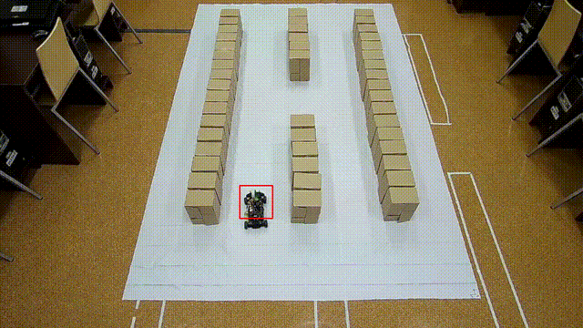

# Lokalizacja Robota w Magazynie z Wykorzystaniem Algorytmów Wizji Komputerowej

## Opis projektu

Projekt polegał na stworzeniu modułu lokalizacji robota w magazynie za pomocą algorytmów wizji komputerowej, wykorzystujących obrazy z dwóch kamer. Celem było określenie pozycji robota z wykorzystaniem metod detekcji obiektów, takich jak YOLO v8 oraz Haar Cascade Classifier, i przekształcenie obrazu w celu określenia lokalizacji robota w przestrzeni magazynowej.

## Cel projektu

Projekt został zrealizowany w ramach prac koła naukowego IDS Industrial Data Science na AGH. Głównym celem projektu było opracowanie systemu, który umożliwia lokalizację robota na podstawie obrazu z dwóch kamer. Został on zaimplementowany jako część cyfrowego bliźniaka magazynu.

## Wykorzystane technologie

- **Algorytm YOLO v8** - algorytm detekcji obiektów w czasie rzeczywistym, który działa z wysoką dokładnością i szybkością.
- **Algorytm Haar Cascade Classifier** - metoda wykrywania obiektów oparta na uczeniu maszynowym, która jest używana do detekcji obiektów w obrazie.
- **Kamery** - dwie kamery używane do zbierania danych w czasie rzeczywistym.
- **OpenCV** - biblioteka do obróbki obrazu i wideo.

## Zrealizowane cele

1. **Detekcja robota** - wykorzystanie algorytmu YOLO v8 oraz Haar Cascade Classifier do wykrywania robota w obrazie z dwóch kamer.
2. **Lokalizacja robota** - na podstawie detekcji, określenie pozycji robota w przestrzeni magazynowej.
3. **Przekształcenie perspektywy** - przekształcenie obrazu w celu uzyskania dokładnej lokalizacji robota w trójwymiarowej przestrzeni magazynowej.

## Algorytmy detekcji

### YOLO v8

- **Dokładność detekcji**: około 95% na zbiorze treningowym.
- **Średni czas detekcji obiektu**: 0,05 sekundy.
- **Zalety**: Bardzo szybki, działa w czasie rzeczywistym, wysoka dokładność.
- **Zastosowanie**: Używany do detekcji robota oraz innych obiektów w przestrzeni magazynowej.

### Haar Cascade Classifier

- **Dokładność detekcji**: około 97% na zbiorze treningowym.
- **Średni czas detekcji obiektu**: 1,5 sekundy.
- **Zalety**: Szybsze przetwarzanie obrazu, mniejsza dokładność w porównaniu do YOLO.
- **Zastosowanie**: Używany jako alternatywa dla YOLO w przypadkach, gdzie czas detekcji jest kluczowy.

## Wyniki

- **Dokładność lokalizacji**: W obu przypadkach (YOLO v8 i Haar Cascade Classifier) lokalizacja robota była możliwa z dużą dokładnością.
- **Skalowalność**: System jest łatwy do skalowania w zależności od potrzeb, zarówno pod względem liczby kamer, jak i rozmiaru magazynu.

## Wnioski

- Algorytm YOLO v8 zapewnia bardzo wysoką dokładność detekcji, ale może wymagać większej mocy obliczeniowej.
- Haar Cascade Classifier jest szybszy w detekcji, ale oferuje nieco niższą dokładność.
- W obu przypadkach lokalizacja robota była możliwa w czasie rzeczywistym, a system może być łatwo skalowany.

## Zrealizowane cele

- Stworzenie systemu detekcji robota za pomocą kamer.
- Lokalizacja robota w przestrzeni magazynowej z wykorzystaniem algorytmów wizji komputerowej.
- Porównanie skuteczności algorytmów YOLO v8 i Haar Cascade Classifier w kontekście detekcji obiektów.

## Dokumentacja i źródła

- [System graficznego rozpoznawania obiektów ruchomych](https://zeszyty-naukowe.wwsi.edu.pl/zeszyty/zeszyt21/System_graficznego_rozpoznawania_obiektow_ruchomych.pdf)
- [Dokumentacja YOLO](https://github.com/ultralytics/ultralytics)
- [Data augmentation for Haar Cascade based automobile detection](https://yadda.icm.edu.pl/baztech/element/bwmeta1.element.baztech-d8acbfd7-c840-4f7e-8865-dfe11a304613/c/Data_augmentation_for.pdf)
- [Calibrate fisheye lens using OpenCV](https://medium.com/@kennethjiang/calibrate-fisheye-lens-using-opencv-333b05afa0b0)
- [Localization of Detected Objects in Multi-Camera Network](https://www.researchgate.net/publication/224359484_Localization_of_detected_objects_in_multi-camera_network)

## Licencja

Projekt jest dostępny na licencji MIT.

## Kontakt

- **Opiekun naukowy**: dr inż. Waldemar Bauer
- **Zespół**: Jakub Mieszczak, Konrad Golemo, Bartłomiej Gawęda
